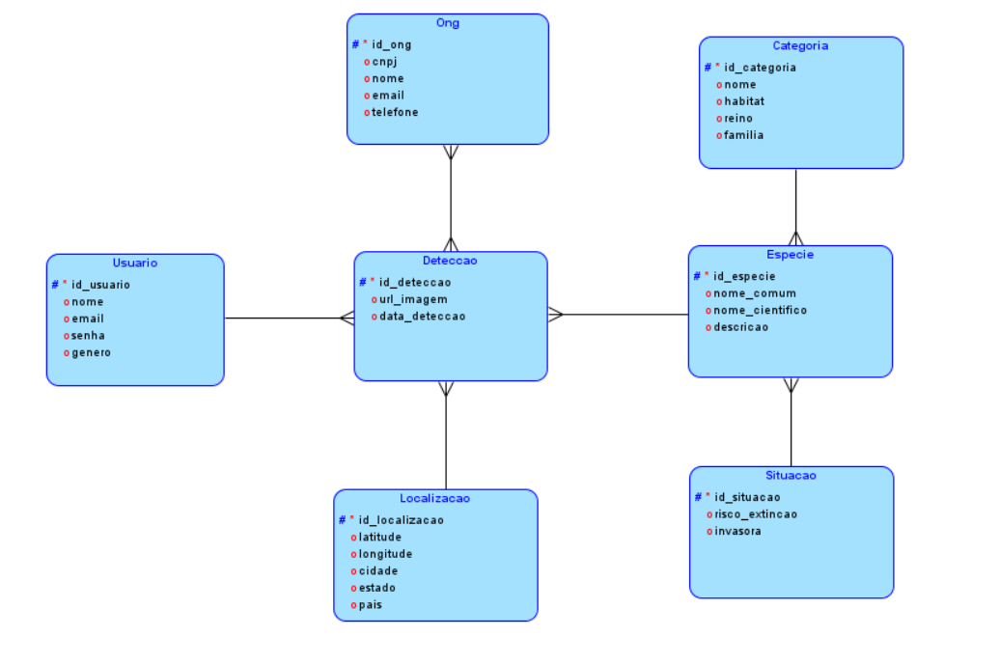
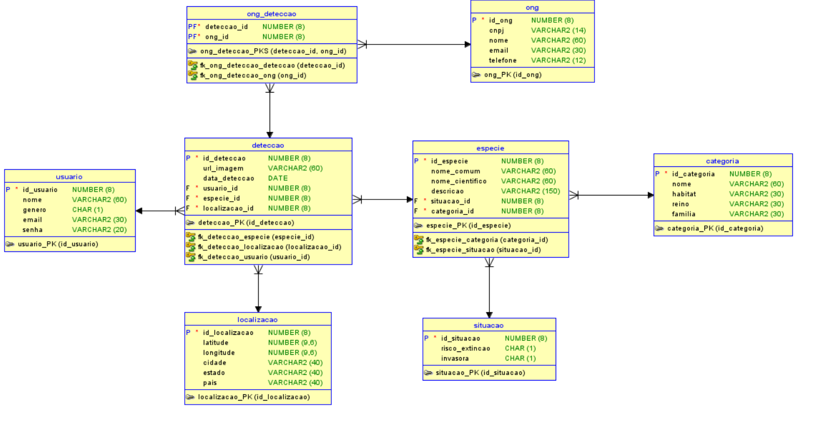

# 🐟 Oceano Vivo 🌊

> Repositório do Banco de Dados: tecnologia a serviço da preservação dos oceanos.

## 📌 Descrição

O projeto "OceanoVivo" visa desenvolver uma solução tecnológica para a identificação automática de espécies marinhas usando inteligência artificial, facilitando o monitoramento e conservação dos ecossistemas oceânicos. Através desta ferramenta, buscamos enfrentar desafios como a pesca excessiva, poluição e mudanças climáticas, que ameaçam a biodiversidade marinha e comprometem a saúde dos ecossistemas oceânicos. A solução inovadora do "OceanoVivo" oferece uma abordagem mais eficiente e precisa para identificar e monitorar espécies marinhas, promovendo a conservação e gestão sustentável dos recursos marinhos.

## 🚀 Funcionalidades

### 📊 Modelagem de Dados

O projeto utiliza o **Oracle Data Modeler** para criar e gerenciar modelos de dados. Esta ferramenta proporciona uma visualização clara da estrutura do banco de dados, facilitando o desenvolvimento e manutenção do esquema.

### 🧩 Modelo Lógico

Visualize a arquitetura do banco de dados no modelo lógico:

### 🧩 Modelo Fisico

Visualize a arquitetura do banco de dados no modelo físico:

### 🗄️ Banco de Dados

O banco de dados foi implementado utilizando **Oracle SQL**, um sistema de gerenciamento de banco de dados relacional (RDBMS) robusto. Abaixo estão algumas das funcionalidades implementadas:

- **Tabela de Registro de Log (registro_log)**: Criada para registrar erros ocorridos durante operações de carga de dados. Essa tabela permite rastrear e analisar eventos não esperados.

### 🔧 Procedures e Blocos Anônimos

Foram desenvolvidos procedimentos armazenados (procedures) e blocos anônimos para facilitar a carga de dados nas tabelas criadas. 

### 📃 Relatórios

Foram criados blocos anônimos para gerar relatórios essenciais para a gestão e monitoramento do projeto:

1. **Relatório de Detecções Mais Recentes**: Utiliza um cursor explícito para identificar e exibir detecções realizadas após uma determinada data.

2. **Relatório de Usuários por Gênero com Detecções**: Utiliza cursores explícitos para contabilizar detecções realizadas por usuários de diferentes gêneros.

3. **Relatório de Espécies em Risco de Extinção**: Utiliza um cursor explícito para identificar e listar espécies que estão em risco de extinção.

4. **Relatório Sumarizado de Espécies por Situação com IDs de Espécies**: Utiliza cursores explícitos para agrupar espécies por situação e apresentar IDs de espécies correspondentes.

> Essas funcionalidades são fundamentais para a administração e análise de dados do projeto "Oceano Vivo", proporcionando uma base sólida para a conservação e gestão sustentável dos recursos marinhos.

## 💻 Tecnologias

As seguintes ferramentas foram usadas neste projeto:

### 🗂️ Modelagem
**Oracle Data Modeler (DER/MER):** Utilizado para criar e gerenciar modelos de dados, facilitando a visualização e a estruturação do banco de dados.

### 🌐 Banco de Dados
**Oracle SQL :**  é um sistema de gerenciamento de banco de dados relacional (RDBMS) desenvolvido pela Oracle Corporation. 

## 🫂 Integrantes

Aqui estão os membros do grupo que participaram durante desenvolvimento desta GS.

* **RM 552267 - Bianca Leticia Román Caldeira**
  - Turma: 2TDSPH
  - Responsável: Mobile & DevOps
    
* **RM 552252 – Charlene Aparecida Estevam Mendes Fialho**
  - Turma: 2TDSPH
  - Responsável: .NET & Java

* **RM 552258 - Laís Alves da Silva Cruz**
  - Turma: 2TDSPH
  - Responsável: Banco de Dados & DevOps

* **RM 99675 – Lucca Raphael Pereira dos Santos**
  - Turma: 2TDSPW
  - Responsável: IA & PITCH

* **RM 97916 – Fabricio Torres Antonio**
  - Turma: 2TDSPH
  - Responsável: QA

<table>
  <tr>
        <td align="center">
      <a href="https://github.com/biancaroman">
         
        
          <b>Bianca Román</b>
        
      </a>
    </td>
    <td align="center">
      <a href="https://github.com/charlenefialho">
         
        
          <b>Charlene Aparecida</b>
        
      </a>
    </td>
    <td align="center">
      <a href="https://github.com/laiscrz">
         
        
          <b>Lais Alves</b>
        
      </a>
    </td>
     <td align="center">
      <a href="https://github.com/Fabs0602">
         
        
          <b>Fabricio Torres</b>
        
      </a>
    </td>
    <td align="center">
      <a href="https://github.com/LuccaRaphael">
         
        
          <b>Lucca Raphael</b>
        
      </a>
    </td>
  </tr>
</table>

<a href="#top">Voltar para o topo</a>
